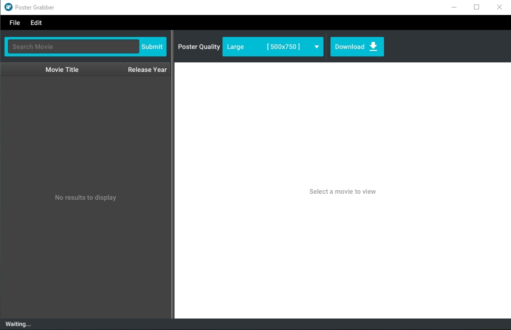
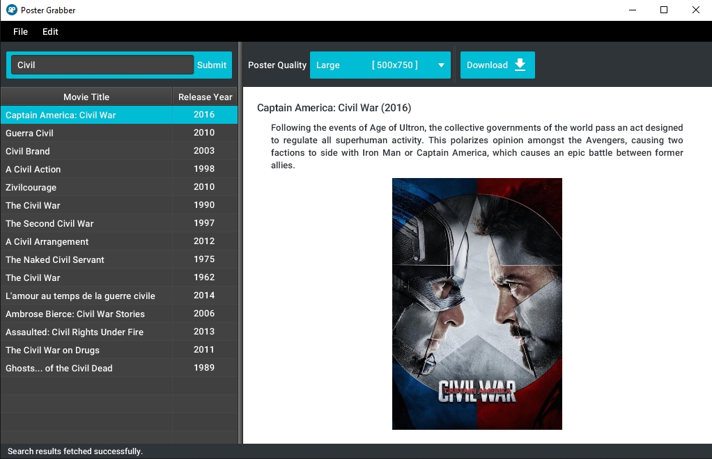

# PosterGrabber

Poster Grabber is a very simple and straight forward tool that grabs a movie poster in any desired quality and save it on the hard disk.

I created this project out of a personal need, since I'm constantly downloading movie's art in the largest quality possible, which might take some time, so having this tool seemed like a good idea at the time.

This is almost my first attempt on JavaFX. So, I might not be following the best practices and I know an alternative approaches might be a better choice.

### Screens




### How to run the source
This application uses [The Movie Database ](https://www.themoviedb.org/documentation/api) to retrieve the results and grabs the poster on movie's selection.  
In order to run the source you need to:
- Replace the string located in `util/Constants.java` with your API key.
    ```java
        public static final String SERVICE_API_KEY = "API KEY";  
    ```

- Build and run the project.
